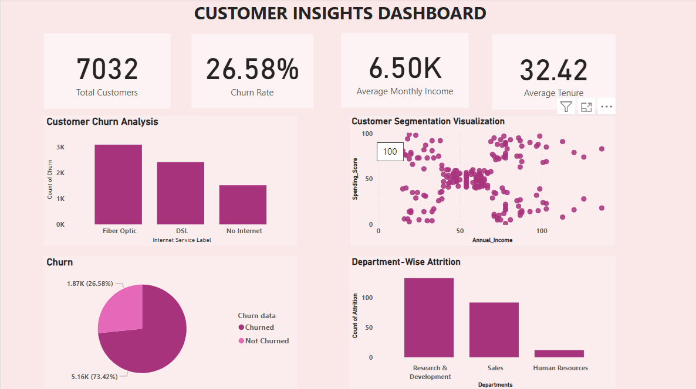

# 📊 Holistic BI System – Retail Telecom Analysis

## 📋 Overview

This project presents a complete Business Intelligence and Data Science solution for a retail telecom company. It integrates interactive dashboards and machine learning to address customer churn, employee attrition, and revenue forecasting , creating a unified system for data-driven decisions across departments.

---

## 🔍 Project Highlights

- 📉 **Churn Prediction** – Machine learning model to identify customers likely to leave  
- 🧍‍♂️ **Employee Attrition** – Classification model for HR analytics  
- 💰 **Sales Forecasting** – Regression-based weekly revenue predictions  
- 🧠 **Customer Segmentation** – K-Means clustering for product strategy  
- 📊 **Executive Dashboard** – Built with Power BI to track KPIs across business units

---

## 🛠️ Tools & Tech Stack

- **Python** – Pandas, NumPy, Scikit-learn, Seaborn  
- **ML Models** – Logistic Regression, Random Forest, KMeans, Linear Regression  
- **Power BI** – Visual KPIs, slicers, drill-through filters  
- **Jupyter Notebook** – End-to-end data pipeline from cleaning to modeling

---

## 🧠 Machine Learning Workflow

All data processing and ML modeling was done inside a single Jupyter Notebook:

📁 `notebooks/Python_notebook.ipynb`

- Data Cleaning & EDA  
- Feature Engineering  
- Model Training & Evaluation  


---

## 🖼️ Dashboard Preview

[](screenshots/Customer_Insights_dashboard.png)  
[](screenshots/Employee_Insights_dashboard.png)

---

## 🗂️ Project Structure

```
Holistic-BI-Telecom-Analysis/
├── dashboards/
│   └── telecom_dashboard.pbix
├── notebooks/
│   └── telecom_analysis.ipynb
├── screenshots/
│   ├── screenshot_2012.png
│   └── screenshot_all.png
└── README.md
```

---

## 👩‍💻 Author

**Khushi Mishra**  
📫 [GitHub](https://github.com/KhushiMishra1707)  

